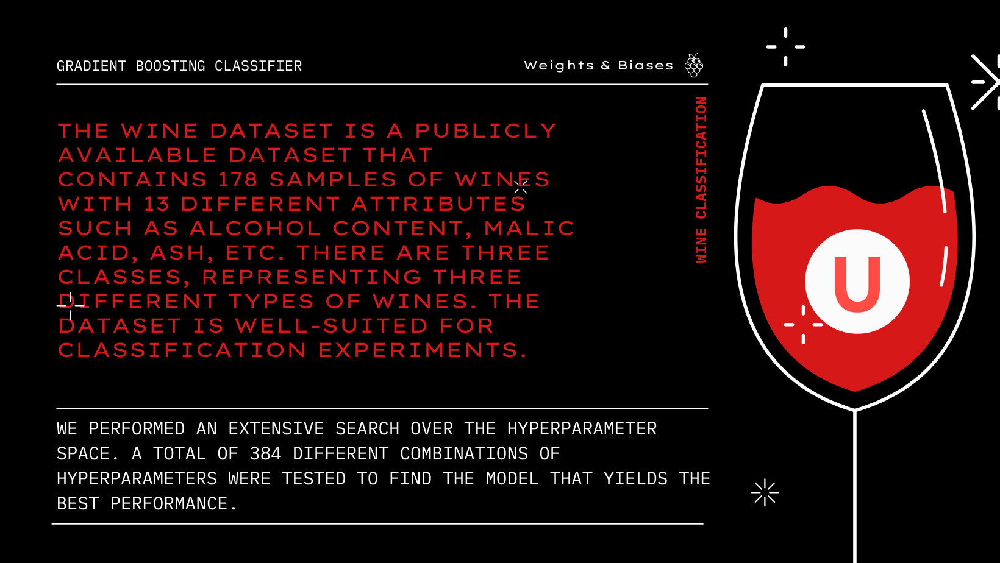

# Gradient Boosting Classifier for Wine Classification   with Weights & Biases

This repository contains an experimentation project for the Data Science class at Upgrade Hub. We use Weights & Biases for the systematic adjustment and assessment of a Gradient Boosting Classifier's hyperparameters using the Wine dataset.

## About Upgrade Hub

[Upgrade Hub](https://www.upgrade-hub.com/) is an educational institution specialized in high-quality educational programs in technology and data science.

## Results

Detailed experimentation outcomes are accessible on the Weights & Biases dashboard, showcasing various metrics like accuracy and the hyperparameters of each test.

🔗 [View Experimentation Results](https://api.wandb.ai/links/doficar91/trj1mxki)

## Problem Description

The project addresses a multi-class classification challenge, aiming to predict wine categories based on physicochemical properties. The Wine dataset serves as a well-regarded benchmark in the machine learning field.

## Dataset

The publicly available Wine dataset comprises 178 wine samples across 13 attributes, such as Alcohol content and Malic acid, categorized into three wine types. It's apt for classification tests.

## Experimentation

The project leverages the Gradient Boosting Classifier, an effective ensemble algorithm for classification, experimenting with hyperparameters like learning rate and tree depth to find the optimal model.

## Hyperparameter Tuning and Best Model

An exhaustive search tested 388 hyperparameter combinations, leading to a model with **0.9815** accuracy, showcasing its efficiency in classifying wines. The optimal hyperparameters include a 0.1 learning rate and a 4 max depth, among others.

- learning_rate : 0.1
- max_depths: 4
- n_estimator: 43
- loss_functions: deviance
- subsamples: 1
- min_samples_splits: 2
- min_samples_leaf: 1

This combination of hyperparameters allowed the Gradient Boosting Classifier to capture the underlying patterns in the data efficiently and make highly accurate predictions.

## Running the Code

To run the code, first, ensure you have all the dependencies installed:

## Contributions

Contributions are encouraged, with a reminder to adhere to best practices and thorough documentation.

